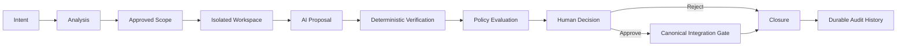
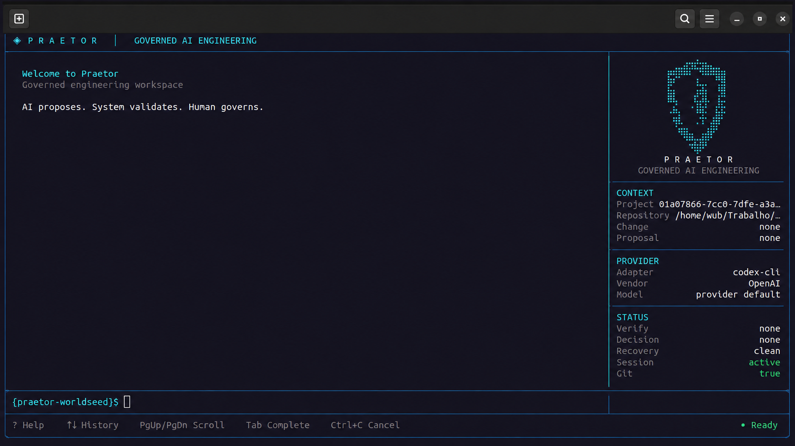

<div align="center">
  

# Praetor

**Governed AI Software Engineering Runtime**

> **AI proposes. System validates. Human governs.**

[](https://go.dev/)
[](LICENSE)
[](#project-status)

</div>

Praetor is a developer-governed software engineering orchestration runtime that uses AI agents as **constrained executors** inside deterministic, spec-driven and policy-enforced engineering workflows.

It is designed around a simple idea:

> **Make the smallest safe change possible — with evidence.**

Rather than treating model output as trusted engineering work, Praetor treats AI output as a proposal that must pass through explicit scope, verification, policy and human-governance boundaries before it can affect canonical source.

---

## Why Praetor?

AI coding tools can generate changes faster than engineering teams can reliably answer questions such as:

- Was the change limited to the intended scope?
- Did it preserve existing behavior?
- Which tests, checks and evidence support it?
- Was the architecture respected?
- Can the decision be audited later?
- Who or what was actually authorized to advance the change?

Praetor explores a different model for AI-assisted engineering: **the model is a capability, not the authority**.

The developer governs. The system validates. AI proposes and executes bounded work.

---

## Core principles

Praetor is built around seven product principles:

1. **Developer Sovereignty** — the developer remains the final engineering authority.
2. **Controlled Change** — changes move through explicit, bounded lifecycle states.
3. **Evidence over Confidence** — model confidence is not proof; executable evidence is.
4. **Institutional Engineering Memory** — durable knowledge belongs to the project, not to a provider session.
5. **Provider Independence** — AI providers are adapters behind stable core ports.
6. **Minimum Necessary Change** — prefer the smallest safe change that satisfies the intent.
7. **Knowledge Must Be Revisable** — engineering memory and decisions remain inspectable and correctable.

See the full [Product Thesis](docs/product/PRODUCT_THESIS.md) and [Engineering Manifesto](docs/product/ENGINEERING_MANIFESTO.md).

---

## Governed change loop



Agents produce outputs. They do **not** own lifecycle authority.

A proposal only advances when the system can prove that the required state, evidence and authorization exist.

---

## What exists today

Praetor is already functional as a local governed engineering runtime.

The current implementation includes:

- retained-context interactive engineering console;
- project identity and bounded source scope;
- isolated Git worktrees for proposed changes;
- provider-independent AI execution port;
- `codex-cli` as the current Core V0 provider adapter;
- deterministic verification planning and execution;
- immutable evidence sets;
- explicit human approval/rejection;
- controlled canonical patch application;
- append-oriented audit history;
- durable per-project SQLite authority and recovery;
- policy-as-code evaluation;
- repository intelligence, impact analysis and advisory risk;
- developer-facing status, diagnostics and recovery flows.

The current console looks like this:



---

## Provider model

Praetor's core is provider-independent.

The current Core V0 implementation ships with a `codex-cli` adapter. Provider selection is explicit and session-scoped; provider credentials remain owned by the provider tooling rather than by Praetor.

Current scope:

```text
Praetor Core
    |
    +-- Provider Port
           |
           +-- codex-cli  <-- implemented today
           +-- future adapters
```

Praetor does **not** currently claim multi-provider routing, automatic fallback or provider consensus. Those capabilities must be implemented explicitly rather than implied by the abstraction.

---

## Verification model

Praetor separates AI review from executable evidence.

Evidence is produced by real engineering checks such as:

- tests;
- builds;
- linting;
- static analysis;
- type checks;
- patch-integrity checks;
- source and scope validation.

A model saying that a change *should* work is not equivalent to proving that it works.

---

## Quick start

### Requirements

- Go `1.25.1+`
- Git
- an installed and authenticated provider CLI when using AI execution (`codex` for the current adapter)

### Build

```bash
git clone https://github.com/Eu-Pedro0ficial/praetor.git
cd praetor
go build -o praetor ./cmd/praetor
```

Run Praetor inside a Git repository you want to govern:

```bash
/path/to/praetor
```

The primary interface is the interactive engineering console. Useful root commands include:

```text
status
analysis
change
policy
provider
help
?
```

A typical governed flow evolves through analysis, isolation, implementation, verification, policy evaluation, human disposition and explicit application or closure.

For implementation details and milestone contracts, use the project documentation rather than treating this README as normative specification.

---

## Project status

**Core V0 is complete.**

Milestones `M0.0` through `M1.2` are closed. `M1.3` is the next planned milestone.

The repository intentionally distinguishes between:

- **implemented behavior**;
- **approved architecture**;
- **future target state**;
- **open decisions**.

This distinction is part of the project's governance model: architectural intent is not presented as shipped behavior.

Detailed status and delivery planning live in:

- [Roadmap](docs/roadmap/ROADMAP.md)
- [Milestones](docs/roadmap/MILESTONES.md)
- [Delivery Strategy](docs/roadmap/DELIVERY_STRATEGY.md)
- [Open Decisions](docs/roadmap/OPEN_DECISIONS.md)

---

## Architecture & documentation

Praetor maintains its architecture as a first-class engineering artifact.

Documentation is organized under [`docs/`](docs/README.md):

- [`docs/architecture/`](docs/architecture/) — normative arc42 + C4 architecture;
- [`docs/product/`](docs/product/) — product thesis, manifesto and positioning;
- [`docs/research/`](docs/research/) — research and comparative studies;
- [`docs/roadmap/`](docs/roadmap/) — roadmap, milestones, dependencies and open decisions.

The architecture and accepted decisions are authoritative. Code should not silently contradict an accepted architectural decision.

---

## Non-goals and current boundaries

Praetor is not intended to be an autonomous coding agent that silently modifies a repository.

Today, it also does not claim:

- hostile-code containment;
- VM/container/process-level security sandboxing for generated code;
- autonomous merge, push or pull-request creation;
- multi-provider fallback or consensus;
- replacement of human engineering judgment.

Its source isolation is based on Git worktrees and bounded change authority. Security boundaries beyond that must be explicitly designed and implemented.

---

## Contributing

Praetor is in early public development.

Issues and pull requests are welcome, especially when they include clear intent, bounded scope and reproducible evidence.

Before proposing a substantial architectural change, please open an **Architecture Proposal** issue so the problem, constraints and trade-offs can be discussed before implementation.

Pull requests should follow the repository template and preserve the project's core principle:

> **Make the smallest safe change possible — with evidence.**

---

## License

Praetor is released under the [MIT License](LICENSE).

Copyright © 2026 Pedro Cardoso.

---

## Community

- [Contributing Guidelines](CONTRIBUTING.md)
- [Security Policy](SECURITY.md)
- [Code of Conduct](CODE_OF_CONDUCT.md)
