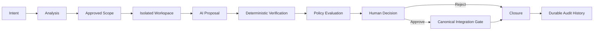

<div align="center">
  

# Praetor

**Governed AI Software Engineering Runtime**

> **AI proposes. System validates. Human governs.**

[](https://github.com/Eu-Pedro0ficial/praetor/actions/workflows/ci.yml)
[](https://github.com/Eu-Pedro0ficial/praetor/actions/workflows/release.yaml)
[](https://go.dev/)
[](LICENSE)
[](#project-status)

[Documentation](docs/README.md) · [Roadmap](docs/roadmap/ROADMAP.md) · [Releases](https://github.com/Eu-Pedro0ficial/praetor/releases) · [Contributing](CONTRIBUTING.md) · [Security](SECURITY.md)

</div>

Praetor is a developer-governed software engineering orchestration runtime that uses AI agents as **constrained executors** inside deterministic, spec-driven and policy-enforced engineering workflows.

It is built around one maintenance principle:

> **Make the smallest safe change possible — with evidence.**

Praetor does not treat model output as trusted engineering work. AI output begins as a **proposal** and must pass through explicit scope, isolated execution, deterministic verification, policy evaluation and human governance before it can affect canonical source.

---

## Why Praetor?

AI coding tools can generate code faster than engineering teams can reliably answer the questions that matter after generation:

- Was the change limited to the intended scope?
- Did it preserve existing behavior?
- Which tests and checks prove that it works?
- Did it respect architectural constraints?
- Can the decision be inspected and audited later?
- Who or what was authorized to advance the change?

Praetor explores a different operating model:

> **The model is a capability, not the authority.**

The developer governs. The system validates. AI proposes and executes bounded work.

---

## Engineering console


The console keeps project, provider, change, verification, decision, recovery and Git context visible while the developer remains in control of the engineering lifecycle.

---

## Governed change loop



Agents produce outputs. They do **not** own lifecycle authority.

A change advances only when the required state, evidence and authorization exist.

---

## What exists today

Praetor is already functional as a local governed engineering runtime.

| Capability | Current state |
| --- | --- |
| Retained-context engineering console | Implemented |
| Project identity and bounded source scope | Implemented |
| Isolated Git worktrees for proposed changes | Implemented |
| Provider-independent AI execution port | Implemented |
| `codex-cli` provider adapter | Implemented |
| Deterministic verification planning and execution | Implemented |
| Immutable evidence sets | Implemented |
| Explicit human approval / rejection | Implemented |
| Controlled canonical patch application | Implemented |
| Append-oriented audit history | Implemented |
| Durable per-project SQLite authority and recovery | Implemented |
| Policy-as-code evaluation | Implemented |
| Repository intelligence, impact analysis and advisory risk | Implemented |
| Specification + ChangePlan governance | Next milestone — M1.3 |

The repository intentionally distinguishes **implemented behavior**, **approved architecture**, **future target state** and **open decisions**. Architectural intent is never presented as shipped behavior.

---

## Core principles

Praetor is built around seven product principles:

1. **Developer Sovereignty** — the developer remains the final engineering authority.
2. **Controlled Change** — changes move through explicit, bounded lifecycle states.
3. **Evidence over Confidence** — model confidence is not proof; executable evidence is.
4. **Institutional Engineering Memory** — durable knowledge belongs to the project, not to a provider session.
5. **Provider Independence** — AI providers are adapters behind stable core ports.
6. **Minimum Necessary Change** — prefer the smallest safe change that satisfies the intent.
7. **Knowledge Must Be Revisable** — engineering memory and decisions remain inspectable and correctable.

Read the full [Product Thesis](docs/product/PRODUCT_THESIS.md) and [Engineering Manifesto](docs/product/ENGINEERING_MANIFESTO.md).

---

## Provider model

Praetor's core is provider-independent.

```text
Praetor Core
    |
    +-- Provider Port
           |
           +-- codex-cli  <-- implemented today
           +-- future adapters
```

The current Core V0 implementation ships with a `codex-cli` adapter. Provider selection is explicit and session-scoped, and provider credentials remain owned by the provider tooling rather than by Praetor.

Praetor does **not** currently claim multi-provider routing, automatic fallback or provider consensus.

---

## Verification model

Praetor separates AI review from executable evidence.

Evidence is produced by real engineering checks such as tests, builds, linting, static analysis, type checks, patch-integrity checks and source/scope validation.

> A model saying that a change *should* work is not equivalent to proving that it works.

---

## Download

Binary releases are published from version tags through GitHub Actions.

### Currently supported release targets

| Platform | Architecture | Package |
| --- | --- | --- |
| Linux | amd64 | `.tar.gz` |
| Linux | arm64 | `.tar.gz` |

Each release also includes SHA-256 checksums.

Windows and macOS support is planned, but is not currently advertised as
supported. The current runtime contains platform-specific terminal and
file-locking behavior that must be abstracted and validated before those
targets can be distributed responsibly.

Browse available builds on the [Releases page](https://github.com/Eu-Pedro0ficial/praetor/releases).

---

## Build from source

### Requirements

- Go `1.25.1+`
- Git
- an installed and authenticated provider CLI when using AI execution (`codex` for the current adapter)

### Build

```bash
git clone https://github.com/Eu-Pedro0ficial/praetor.git
cd praetor
go build -o praetor ./cmd/praetor
```

Run Praetor inside a Git repository you want to govern:

```bash
/path/to/praetor
```

The primary interface is the interactive engineering console. Useful root commands include:

```text
status
analysis
change
policy
provider
help
?
```

A typical governed flow evolves through analysis, isolation, implementation, verification, policy evaluation, human disposition and explicit application or closure.

---

## Project status

**Core V0 is complete.**

Milestones `M0.0` through `M1.2` are closed. `M1.3 — Specification + Change Plan Governance` is the next planned milestone.

Detailed delivery planning lives in:

- [Roadmap](docs/roadmap/ROADMAP.md)
- [Milestones](docs/roadmap/MILESTONES.md)
- [Delivery Strategy](docs/roadmap/DELIVERY_STRATEGY.md)
- [Open Decisions](docs/roadmap/OPEN_DECISIONS.md)

---

## Architecture and documentation

Praetor treats architecture as a first-class engineering artifact.

Documentation is organized under [`docs/`](docs/README.md):

- [`docs/architecture/`](docs/architecture/) — normative arc42 + C4 architecture;
- [`docs/product/`](docs/product/) — product thesis, manifesto and positioning;
- [`docs/research/`](docs/research/) — research and comparative studies;
- [`docs/roadmap/`](docs/roadmap/) — roadmap, milestones, dependencies and open decisions.

The accepted architecture and ADRs are authoritative. Code must not silently contradict an accepted architectural decision.

---

## Security boundaries

Praetor is not intended to be an autonomous coding agent that silently modifies a repository.

Today it also does not claim hostile-code containment, VM/container/process-level sandboxing for generated code, autonomous merge/push/pull-request authority, multi-provider consensus, or replacement of human engineering judgment.

Source isolation is currently based on Git worktrees and bounded change authority. Those mechanisms are **not equivalent to an operating-system or virtualization security sandbox**.

For vulnerability reporting and current security expectations, see [SECURITY.md](SECURITY.md).

---

## Contributing

Praetor is in early public development.

Issues and pull requests are welcome when they include clear intent, bounded scope and reproducible evidence. Substantial architectural changes should begin as an **Architecture Proposal** issue before implementation.

Read [CONTRIBUTING.md](CONTRIBUTING.md) before submitting non-trivial changes.

> **Make the smallest safe change possible — with evidence.**

---

## Community

- [Contributing Guidelines](CONTRIBUTING.md)
- [Security Policy](SECURITY.md)
- [Code of Conduct](CODE_OF_CONDUCT.md)

---

## License

Praetor is released under the [MIT License](LICENSE).

Copyright © 2026 Pedro Cardoso.
