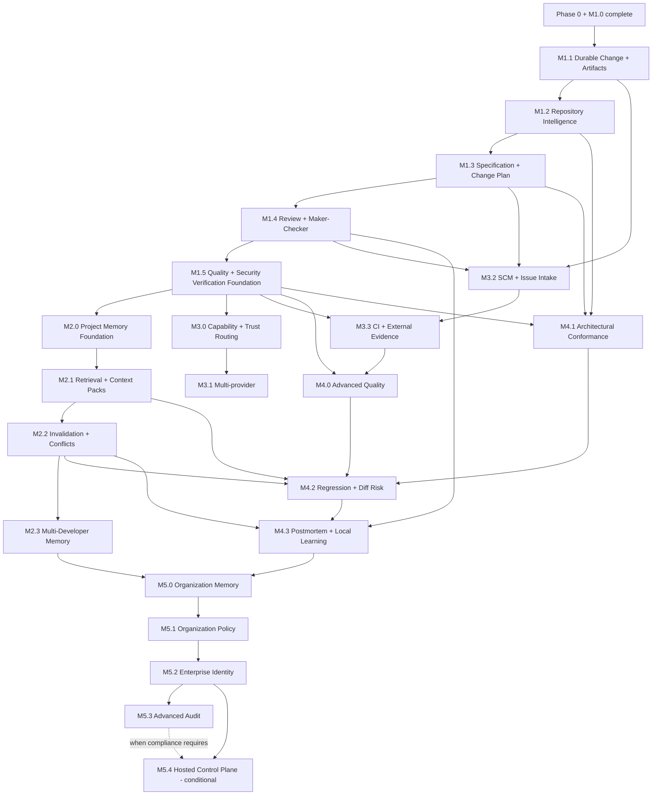

# Roadmap V2 Dependency Graph

## Authority

This graph defines actual milestone dependencies. Phase grouping communicates
product purpose and does not create an implicit dependency on every milestone
in an earlier-numbered phase.

Phase 0 and M1.0 are complete historical facts.



## Dependency rules

1. M1.1 is the common durability foundation. Later artifacts must not invent
   independent process-local authorities.
2. M1.2 context and risk precede M1.3 Specification and ChangePlan governance.
3. M1.4 review consumes exact Specification, Plan, patch, evidence, and policy
   identities established earlier.
4. Source-linked inspection and understandable governance actions are
   cross-cutting acceptance concerns of M1.1 through M1.4, not independent
   milestones; their projections and presentation never establish authority.
5. M1.5 establishes current-run quality/security evidence, explicit assurance,
   bounded tool execution, and secret safeguards before canonical Project
   Memory promotion.
6. Phase 2 proceeds from canonical memory to retrieval, invalidation, and then
   shared multi-developer operation.
7. M3.0 can begin after M1.5; it does not depend on completing Phase 2.
8. M3.2 depends on durable Change/spec/review authority, not on M3.1.
9. M3.3 normally uses M3.2 remote artifact identity but remains an external
   evidence concern, not provider maturity.
10. M4.0 owns historical quality; M4.1 owns architectural conformance; M4.2
   combines those with repository and memory history for regression/DiffRisk.
11. M4.3 requires trustworthy outcomes and local memory, but not Organization
    Memory.
12. M5.0 is repository-backed and non-hosted by default. If its approved
    decision selects hosted multi-tenant persistence, M5.2 and M5.4 become hard
    prerequisites and hosted work must be resequenced.
13. M5.4 remains conditional and may close with an approved determination that
    no control plane is justified.

## Critical path

The Roadmap V2 traceability-first critical path is:

```text
M1.1 -> M1.2 -> M1.3 -> M1.4 -> M1.5
-> M2.0 -> M2.1 -> M2.2 -> M4.3
```

The provider/ecosystem branch is:

```text
M1.5 -> M3.0 -> M3.1
M1.1 + M1.3 + M1.4 -> M3.2 -> M3.3
```

The advanced-intelligence convergence is:

```text
M1.5 + M3.3 -> M4.0
M1.2 + M1.3 + M1.5 -> M4.1
M2.1 + M2.2 + M4.0 + M4.1 -> M4.2 -> M4.3
```

## Decision closure gates

A `DEFERRED`, `BENCHMARK REQUIRED`, `SPIKE REQUIRED`, or undecided gate stops
only the dependent implementation. It does not authorize a different
architecture. Required evidence, an ADR or explicit decision, and human
approval precede implementation.

See `OPEN_DECISIONS.md` for the complete gate inventory and
`docs/architecture/src/docs/arc42/appendices/traceability.adoc` for inverse
ownership.
