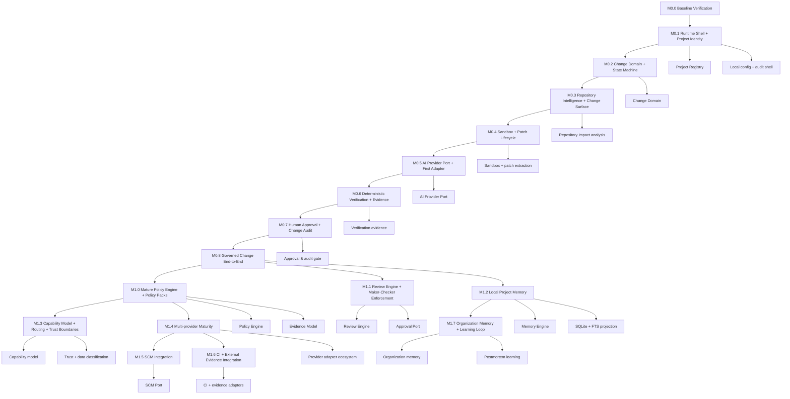

# Dependency Graph

## Summary

This dependency graph reflects the corrected roadmap order: V0 is a gated end-to-end proof, not a single monolithic milestone, and the AI provider abstraction sits before the release gate.

## Dependency logic

1. The repository baseline must exist before implementation begins.
2. Project identity and local shell are required before any execution can be governed.
3. The Change domain, workflow, and bounded scope must be proven before policy, memory, or routing become meaningful.
4. The AI Provider Port and first adapter must exist before V0 so the runtime can use a provider-independent execution contract.
5. M1.0 policy maturity is the dependency for formalized routing and trust-based policy decisions; project memory is not required for capability routing.
6. Memory becomes valuable only after the core change loop works.
7. Organization-scale memory and learning derive primarily from project memory, governance, audit, and promotion authority, not SCM/CI integration.

## Critical path

The critical path is:

M0.0 -> M0.1 -> M0.2 -> M0.3 -> M0.4 -> M0.5 -> M0.6 -> M0.7 -> M0.8

This is the minimal path that proves Praetor’s central thesis.
